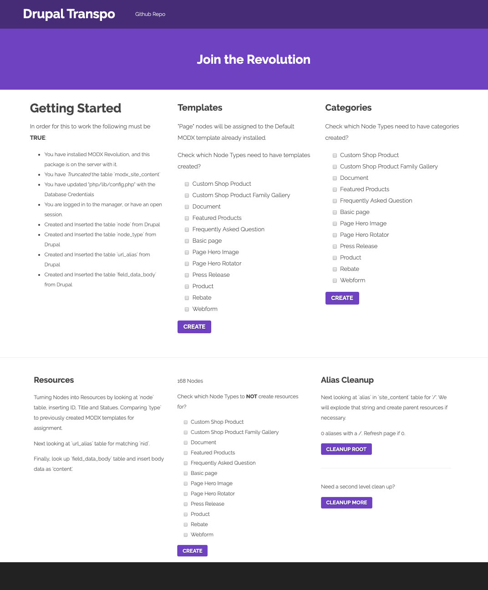

# DrupalTranspo
**Transport Drupal SQL to MODX Revolution**

This is a standalone tutorial package, NOT an Extra you install via the Manager.

>Just Download the zip, add it to your root MODX install, run it and then delete it.

Migrate Nodes to resources and the below values:

 - ID
 - Title
 - alias
 - Body Content
 - Status
 - Templates

*Create Templates and Categories from Node Types*

---

